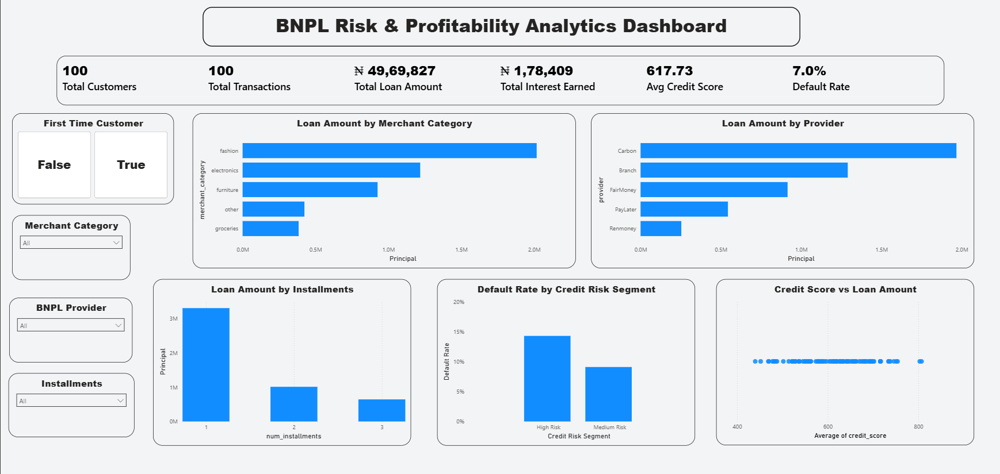

# BNPL Risk & Profitability Analytics Dashboard

## Project Overview
**BNPL (Buy Now, Pay Later)** is a financial service that allows customers to purchase products immediately and pay for them over time through installments.

This project analyzes a simulated **BNPL lending dataset** to understand customer borrowing behavior, credit risk, and profitability patterns using **Power BI**.

The dashboard helps answer key business questions such as:
- Which merchant categories generate the most BNPL transactions?
- Which BNPL providers issue the highest loan amounts?
- How does customer credit score influence borrowing behavior?
- Which customer segments are more likely to default?

The goal is to demonstrate how **data analytics can support risk management and lending decisions in fintech companies**.

---

## Tools & Technologies
- **Power BI** – Data visualization and dashboard creation  
- **DAX (Data Analysis Expressions)** – Calculated columns and measures  
- **Data Modeling** – Data relationships and transformations  
- **GitHub** – Project documentation and version control  

---

## Dataset Description
The dataset contains simulated BNPL transaction records including the following fields:

| Column | Description |
|------|-------------|
| customer_id | Unique identifier for each customer |
| transaction_id | Unique identifier for each transaction |
| principal_ngn | Loan amount issued (in Nigerian Naira) |
| credit_score | Customer credit score |
| merchant_category | Merchant industry category |
| provider | BNPL service provider |
| num_installments | Number of installments chosen |
| default_90d | Whether the loan defaulted within 90 days |
| calculated_interest | Interest earned from the loan |

---

## Dashboard Preview



---

## Key Performance Indicators (KPIs)

The dashboard tracks several important lending metrics:

- **Total Customers** – Number of unique customers using BNPL
- **Total Transactions** – Total number of loan transactions
- **Total Loan Amount** – Total value of loans issued
- **Total Interest Earned** – Revenue generated from loans
- **Average Credit Score** – Overall customer credit quality
- **Default Rate** – Percentage of loans defaulting within 90 days

---

## Dashboard Visualizations

### 1. Loan Amount by Merchant Category
Shows which merchant industries receive the highest BNPL loan amounts.

### 2. Loan Amount by Provider
Compares lending activity between different BNPL providers.

### 3. Loan Amount by Number of Installments
Analyzes customer repayment preferences based on installment selection.

### 4. Credit Score vs Loan Amount
Scatter plot showing the relationship between customer creditworthiness and borrowing behavior.

### 5. Default Rate by Credit Risk Segment
Customers are segmented into **High Risk, Medium Risk, and Low Risk** groups based on credit score to identify default patterns.

---

## Credit Risk Segmentation Logic

```DAX
Credit Risk Segment =
SWITCH(
TRUE(),
bnpl_full_sample[credit_score] < 550, "High Risk",
bnpl_full_sample[credit_score] < 650, "Medium Risk",
"Low Risk"
)
```

---

## Default Rate Calculation

```DAX
Default Rate =
AVERAGE(bnpl_full_sample[default_90d])
```

Where:
- **TRUE / 1** → Default  
- **FALSE / 0** → No Default  

---

## Key Insights

- Some **merchant categories drive higher BNPL usage** than others.
- Customers with **higher credit scores tend to take larger loans**.
- **Installment preferences influence loan size and repayment behavior**.
- **High-risk customers show a higher probability of default**, highlighting potential risk areas for lenders.

---

## Project Objective
The objective of this project is to demonstrate how **data visualization and analytics can help fintech companies monitor lending performance, manage credit risk, and improve profitability**.

This project highlights skills in:
- Business Intelligence
- Data Visualization
- Risk Analysis
- Financial Data Analytics
- Data Storytelling

---
